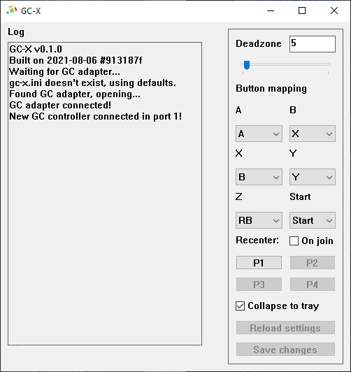

# GC-X
Want to use your Nintendo-compatible GameCube controller adapter on your PC for things that aren't Dolphin?
You're in the right place.
**GC-X** allows you to control PC games with GameCube controllers as if they were Xbox controllers.

You can download the latest release from the [Releases](https://github.com/skyfloogle/gc-x/releases/latest) tab.

## Features
* Customizable button mappings and deadzone
* Minimal input lag
* Uses the same GC adapter tech as [Dolphin](https://dolphin-emu.org/), and the same controller emulation tech as [Parsec](https://parsec.app/)
* Programmed in [Rust](https://www.rust-lang.org/) for maximum performance
* Lives quietly in the system tray

## Required setup
GC-X uses the same GC adapter tech as Dolphin, so it requires the same setup with Zadig.
This part of the setup is described [here](https://dolphin-emu.org/docs/guides/how-use-official-gc-controller-adapter-wii-u/#Using_Zadig).
If you already use your adapter with Dolphin, you will already have done this.

The controller emulation also requires [VIGEmBus](https://github.com/ViGEm/ViGEmBus/releases) to be installed.
**Keep in mind that this driver is currently unmaintained.**
